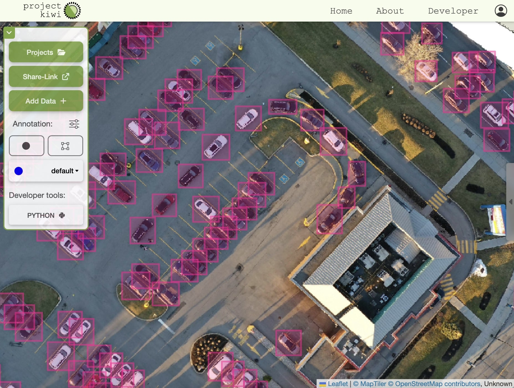

Welcome to Project Kiwi
============================================

Project Kiwi has been designed from the ground up to allow users to bring their own science to their GIS data. 
At it's core it can be used as a tool to label data with assistance from your models. We hope this API will allow you to apply your own models or get started with the object detection models that are available at the time of writing!

----

Installation
--------------------------

Installing the projectkiwi package is very simple:

.. code:: bash

  pip install projectkiwi3-client

----

Usage
-----

.. toctree::
  :maxdepth: 3

  source/basic_usage

----

API Reference
-------------

Find functional documentation here.

.. toctree::
  :maxdepth: 2

  source/projectkiwi

----

Contributing
------------

Please submit an issue or even a pull request if you have any suggestions for how the python API could better suit your needs.
The best place to do this is on `GitHub`_.

----

Contact
-------

To get in touch with the development team, please email:
**michael@projectkiwi.io**.

.. _GitHub: https://github.com/michaelthoreau/projectkiwi3-client

